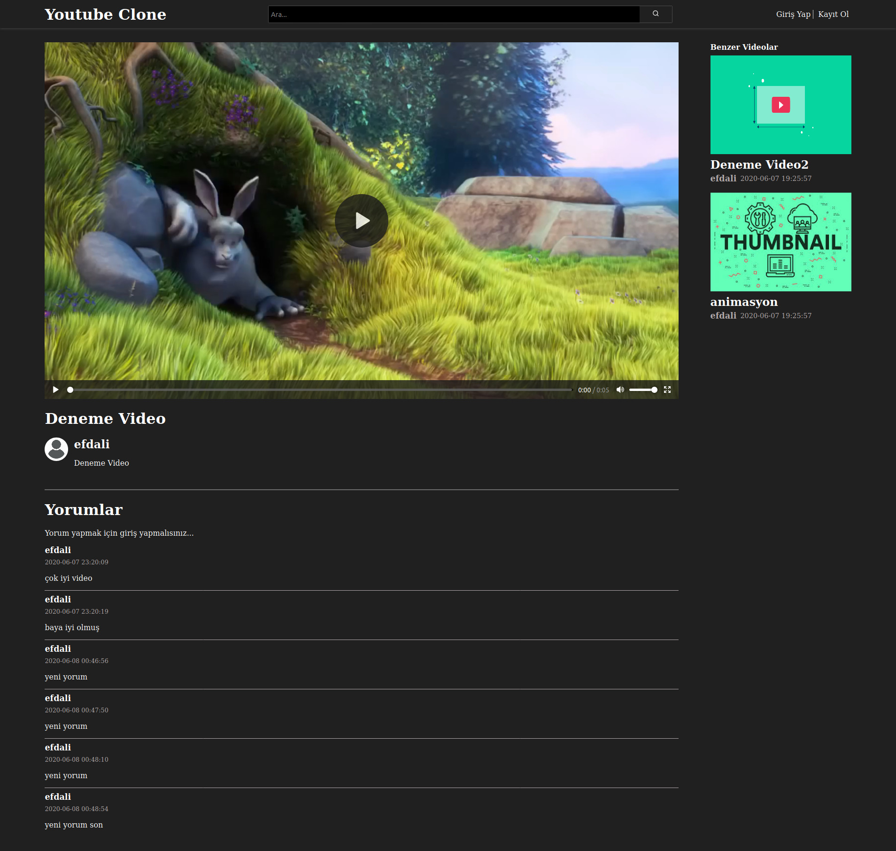
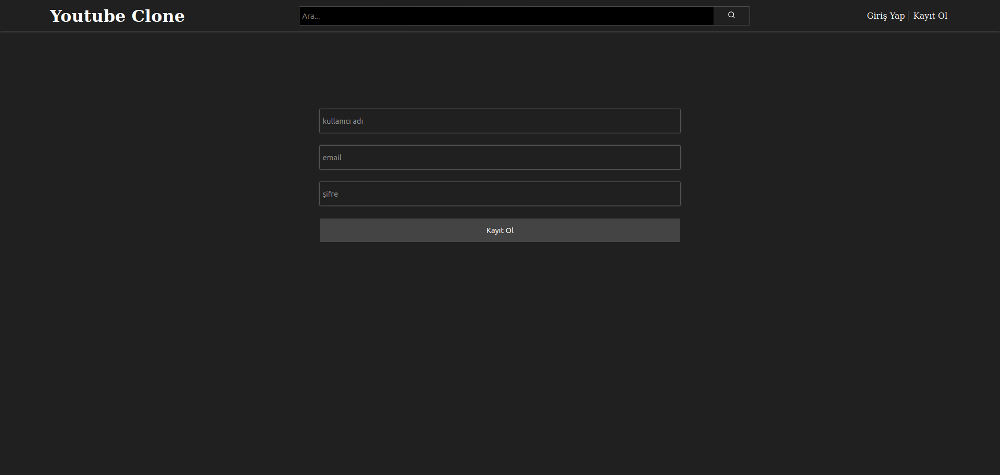

# Youtube Clone

**I coded this project with php for  internet and web programming lesson homework**

## Installation

```
 1. move 'youtube_clone' folder to 'htdocs' folder
 2. import 'youtube_clone.sql' file with phpmyadmin
 3. change sql connection informations on helpers/db.php file
 4. type 'localhost/youtube-clone' on your default browser
```






